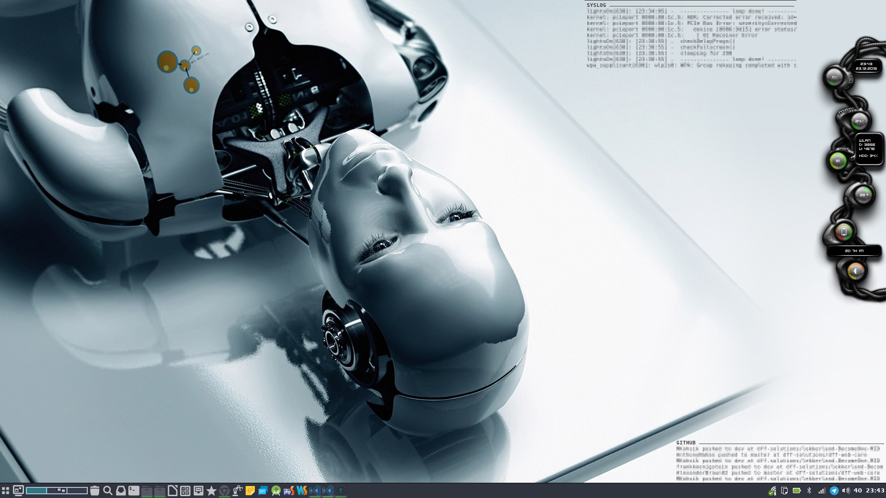

# Bionic Conky Continued

## Installation

+ git clone or extract the repository to ```~/.conky/bionic-contd```<br>
*(```mkdir -p ~/.conky/bionic-contd && git clone https://github.com/dubitabam/bionic-contd.git ~/.conky/bionic-contd```)*
+ install the fonts
+ adjust paths in [conkyrc](conkyrc) if necessary
+ change wallpaper
+ add ```conky -c ~/.conky/bionic-contd/conkyrc &``` to your autostart
+ enjoy

----

## Configuration

#### Volume

If you don't have oss emulation enabled use the get-volume.sh script. You have to change this in rings.lua

More information about oss emulation:
+ [www.alsa-project.org](http://www.alsa-project.org/~tiwai/OSS-Emulation.html)
+ [wiki.archlinux.org](https://wiki.archlinux.org/index.php/Advanced_Linux_Sound_Architecture#OSS_compatibility)

----

[](raw/screenshot.jpg)

----

*Based on [Bionic Conky 1.0 by Mucas](http://gnome-look.org/content/show.php/Bionic+Conky?content=134471)*
